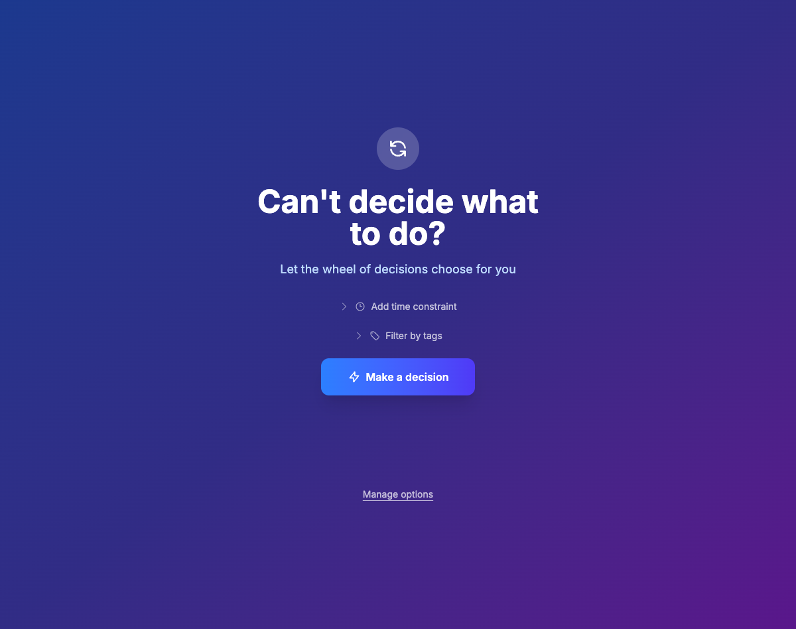

# Make a Decision

A simple, interactive decision-making wheel application. Spin the wheel to make random selections from your custom options. Perfect for making choices, picking winners, or just having fun with randomness.

## Screenshot



## Download

Pre-built binaries and Docker images are available from the [GitHub Releases](https://github.com/Piszmog/make-a-decision/releases) page.

### Binary Installation

Download the appropriate binary for your platform from the latest release:

- **Linux**: `make-a-decision_Linux_x86_64.tar.gz`
- **macOS**: `make-a-decision_Darwin_x86_64.tar.gz` or `make-a-decision_Darwin_arm64.tar.gz`
- **Windows**: `make-a-decision_Windows_x86_64.zip`

Extract the archive and run the binary.

### Docker

```shell
docker pull ghcr.io/piszmog/make-a-decision:latest
docker run -p 8080:8080 ghcr.io/piszmog/make-a-decision:latest
```

## Running the Application

### Quick Start

Simply run the binary:

```shell
./make-a-decision
```

The application will start on port 8080. Open your browser to http://localhost:8080/

### Configuration

The application can be configured using environment variables:

| Variable | Description | Default |
|----------|-------------|---------|
| `PORT` | Server port | `8080` |
| `DB_URL` | SQLite database file path | `./db.sqlite3` |
| `LOG_LEVEL` | Logging level (debug, info, warn, error) | `info` |
| `LOG_OUTPUT` | Log format (text, json) | `text` |

Example:

```shell
PORT=3000 LOG_LEVEL=debug ./make-a-decision
```

### Docker

```shell
docker run -p 8080:8080 -v $(pwd)/data:/data -e DB_URL=/data/db.sqlite3 ghcr.io/piszmog/make-a-decision:latest
```

## Building from Source

If you want to build the application yourself:

### Prerequisites

- Go 1.21 or later
- [air](https://github.com/air-verse/air#installation) for local development (optional)

### Build

```shell
go build -o make-a-decision ./cmd/server
```

### Development

For local development with live reloading:

```shell
air
```

See [DEVELOPMENT.md](DEVELOPMENT.md) for detailed development instructions.

## License

This project is open source and available under the MIT License.

## Contributing

Contributions are welcome! Please see [DEVELOPMENT.md](DEVELOPMENT.md) for development setup and guidelines.

